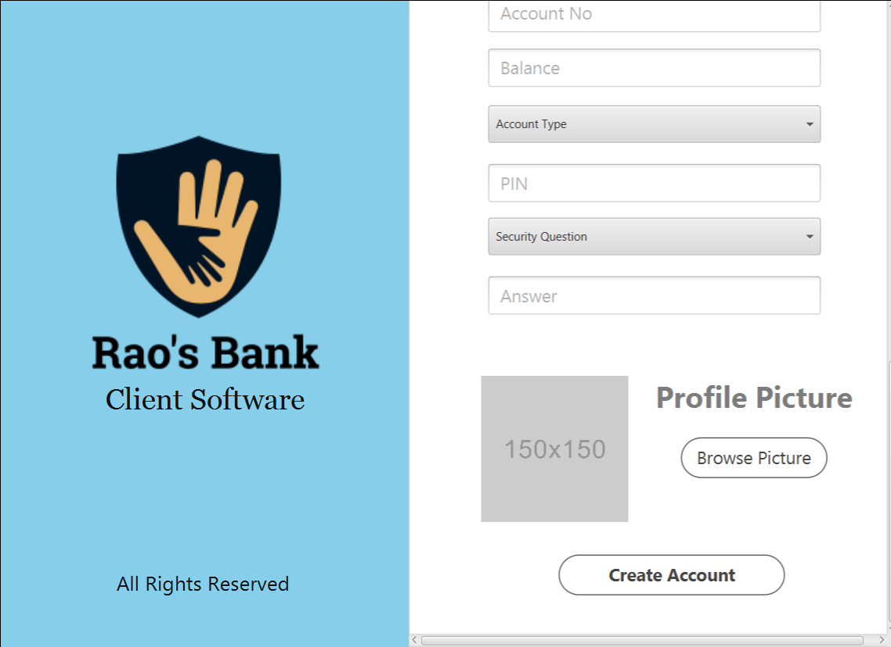

# Banking-Application
This is a replica of Bank Software, in which you can store the information of a account holder.

### What can this do?
  - Withdraw or deposit the amount into your account
  - Transfer or receive money from others
  - Check your transaction history
  - Change your password or recover it if you forgot

### Software Used
  - Eclipse Ide
  - SceeneBuilder --> for designing
  - Xampp and phpMyAdmin --> for creating and using local server

### Reason Behind this.
The main objective of creating this is learning by practical experience. Which I think is the best way of aquring more knowledge on a subject. 

### Screenshots
<table>
  <tr>
    <td>Home Screen</td>
    <td>Create Account</td>
    <td>Create Account</td>
  </tr>
  <tr>
    <td></td>
    <td></td>
    <td></td> 
  </tr>
 </table>
 
 <table>
  <tr>
    <td>Dashboard</td>
    <td>User Informationt</td>
    <td>Transaction History</td>
  </tr>
  <tr>
    <td></td>
    <td></td>
    <td></td> 
  </tr>
 </table>
 
 <table>
  <tr>
    <td>Deposit Screen</td>
    <td>Withdarw Screen</td>
    <td>Transfer Screen</td>
  </tr>
  <tr>
    <td></td>
    <td></td>
    <td></td> 
  </tr>
 </table>
 
  <table>
  <tr>
    <td>Deposit Screen</td>
    <td>Withdarw Screen</td>
  </tr>
  <tr>
    <td></td>
    <td></td>
  </tr>
 </table>
 
 
